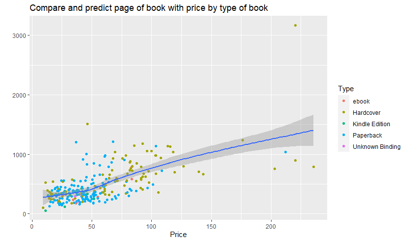
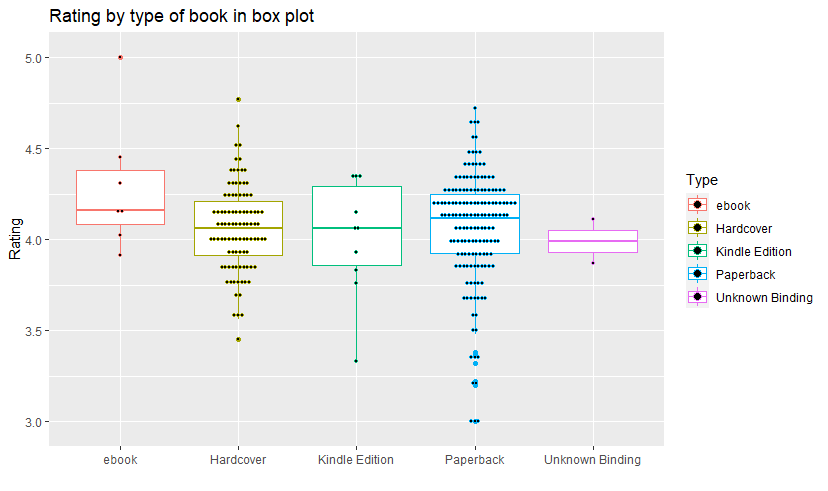

# Top 270 rated computer science programing book

## Resourse
Exploring data from kaggle dataset ( [Kaggle](https://www.kaggle.com/thomaskonstantin/top-270-rated-computer-science-programing-books) ) and dataset in csv file is in here ( [Dataset](https://raw.githubusercontent.com/safesit23/INT214-Statistics/main/datasets/prog_book.csv) )

## Into my dashboard


## Preparing to explore

1.) install Package readr assertive stringr dplyr and ggplot2.

```{R}
install.packages("dplyr")
install.packages("readr")
install.packages("stringr")
install.packages("ggplot2")
lnstall.packages("assertive")
```

2.) import package readr assertive stringr dplyr and ggplot2.

```{R}
library(dplyr)
library(readr)
library(stringr)
library(ggplot2)
library(assertive)
```

3.) import dataset and read from csv file and view it.

```{R}
ProgBook <- read.csv("https://raw.githubusercontent.com/safesit23/INT214-Statistics/main/datasets/prog_book.csv")

View(ProgBook)
```

## Explore a Data
```{R}
glimpse(ProgBook)
# Rows: 271
# Columns: 7
# $ Rating          <dbl> 4.17, 4.01, 3.33, 3.97, 4.06, 3.84, 4.09, 4.15, 3.87, 4.62, 4.03, 3.78, 3.~
# $ Reviews         <chr> "3,829", "1,406", "0", "1,658", "1,325", "117", "5,938", "1,817", "2,093",~
# $ Book_title      <chr> "The Elements of Style", "The Information: A History, a Theory, a Flood", ~
# $ Description     <chr> "This style manual offers practical advice on improving writing skills. Th~
# $ Number_Of_Pages <int> 105, 527, 50, 393, 305, 288, 256, 368, 259, 128, 352, 352, 200, 328, 240, ~
# $ Type            <chr> "Hardcover", "Hardcover", "Kindle Edition", "Hardcover", "Kindle Edition",~
# $ Price           <dbl> 9.323529, 11.000000, 11.267647, 12.873529, 13.164706, 14.188235, 14.232353~
```
### Column name

**Rating:** The user rating for the book. the rating score ranges between 0 and 5.

**Reviews:** The number of reviews found on this book.

**Book_title:** The name of the book.

**Description:** a short description of the book.

**Number of page:** Number of pages in the book.

**Type:** The type of the book meaning is it a hardcover book or an ebook or a kindle book etc.

**Price:** The average price of the book in USD where the average is calculated according the 5 web sources.

# Data analysis 
1.) find top 10 books title have most rating.
```{R}
TopRating <- ProgBook %>% select(Book_title,Rating) %>% arrange(desc(Rating)) %>% head(10)
TopRating
```

result from output:

```{R}
# show top 10 books title have most rating
#                                                                                                  Book_title  Rating
# 1                                                                                   Your First App: Node.js   5.00
# 2                                                   The Art of Computer Programming, Volumes 1-4a Boxed Set   4.77
# 3  Designing Data-Intensive Applications: The Big Ideas Behind Reliable, Scalable, and Maintainable Systems   4.72
# 4               Build Web Applications with Java: Learn every aspect to build web applications from scratch   4.67
# 5                                                  Fluent Python: Clear, Concise, and Effective Programming   4.67
# 6                                           ZX Spectrum Games Code Club: Twenty fun games to code and learn   4.62
# 7                             The Linux Programming Interface: A Linux and Unix System Programming Handbook   4.62
# 8                                                                          CLR via C# (Developer Reference)   4.58
# 9                       The Elements of Computing Systems: Building a Modern Computer from First Principles   4.54
# 10                                                                 Practical Object Oriented Design in Ruby   4.54
```

2.) find top 10 books title have most number of page.

```{R}
TopPage <- ProgBook %>% select(Book_title,Number_Of_Pages) %>% arrange(desc(Number_Of_Pages)) %>% head(10)
TopPage
```

result from output:

```{R}
# show top 10 book have most number of pages and can find outliner value
#                                                                       Book_title Number_Of_Pages
# 1                        The Art of Computer Programming, Volumes 1-4a Boxed Set            3168
# 2  The Linux Programming Interface: A Linux and Unix System Programming Handbook            1506
# 3                             Numerical Recipes: The Art of Scientific Computing            1235
# 4                                                                Learning Python            1214
# 5                                                               Beginning Java 2            1200
# 6                                                     Introduction to Algorithms            1180
# 7                                                       Database System Concepts            1142
# 8                                          Modern Operating Systems, 4th Edition            1136
# 9                             The C++ Standard Library: A Tutorial and Reference            1136
# 10                                    Artificial Intelligence: A Modern Approach            1132
```
3.) find count in each type book.

```{R}
TypeBook <- ProgBook %>% count(Type) %>% summarise(TypeBook=Type,count=n) 
TypeBook
```

result from output:

```{R}
# show book count in each type of book
#          TypeBook count
# 1           ebook     7
# 2       Hardcover    96
# 3  Kindle Edition    10
# 4       Paperback   156
# 5 Unknown Binding     2
```

4.) Find average of rating, review, number of page and price in each Type of book.

```{R}
AverageTypeBook <- ProgBook %>%
  group_by(Type) %>%
  select(Rating,Reviews,Number_Of_Pages,Price) %>%
  summarise(avg_rating=mean(Rating),
            avg_review=mean(Reviews),
            avg_number_page=mean(Number_Of_Pages),
            avg_price=mean(Price)
            )
AverageTypeBook
```

result from output:

```{R}
# show average of rating, review, number of page and price in each type of book
# A tibble: 5 x 5
#   Type            avg_rating avg_review avg_number_page avg_price
#   <chr>                <dbl>      <dbl>           <dbl>     <dbl>
# 1 ebook                 4.29       51.4            386       51.4
# 2 Hardcover             4.06      312.             617.      71.7
# 3 Kindle Edition        4.01      156.             283.      32.4
# 4 Paperback             4.06      116.             407.      45.8
# 5 Unknown Binding       3.99      124.             249       37.2
```

## Find insight of data visualization

### Histogram
1.) Show histogram of rating book by bandwidth = 0.5.
```{R}
# plot histogram
HistRating <- ProgBook %>% ggplot(aes(x=Rating)) + geom_histogram(fill="gold",col="white",binwidth=0.5)

# show histogram
HistRating + ggtitle("Number show rating book") +
  xlab("Rating") + ylab("Count")
```

result from output:


2.) Show histogram of number of page book by bandwidth = 100.
```{R}
# plot histogram
HistPage <- ProgBook %>% ggplot(aes(x=Number_Of_Pages)) + geom_histogram(fill="maroon",col="gold",binwidth=100)

# show histogram
HistPage + ggtitle("Number show number of page book") +
  xlab("Number of page") + ylab("Count")
```

result from output:


### Bar chart
1.) Show top 5 type book have the most reviews in each type book.
```{R}
# plot barchart
BarTypeTopAvgReview <- AverageTypeBook %>% ggplot(aes(x=reorder(Type, -avg_review),y=avg_review)) + geom_bar(stat = "identity",fill="purple",col="violet")

# show barchart
BarTypeTopAvgReview + ggtitle("Top 5 type books have the most average reviews") +
  xlab("") + ylab("average of Review")
```

result from output:


2.) Show top 5 type book have the most average price in each type book.
```{R}
# plot barchart
BarTypeTopAvgPrice <- AverageTypeBook %>% ggplot(aes(x=reorder(Type, -avg_price),y=avg_price)) + geom_bar(stat = "identity",fill="lightgreen",col="green")


# show barchart
BarTypeTopAvgPrice + ggtitle("Top 5 type books have the most average price") +
  xlab("") + ylab("average of price")
```

result from output:


### Pie chart
Show count of book in type of book to pie chart.
```{R}
# plot piechart
PieTypeBook <- ggplot(TypeBook,aes(x="",y=count,fill = TypeBook)) +
  geom_col() + coord_polar(theta = "y")

# show barchart
PieTypeBook + ggtitle("Number show each type of book") + xlab("") + ylab("All book have 271 books")
```

result from output:


### Scatter plot
Compare rating and reviews by show each type of book are different.
```{R}
# A) plot scatter with point
ScatterRatingReview <- ProgBook %>% ggplot(aes(x=Rating,y=Reviews)) + geom_point(aes(color=Type))

# B) plot scatter with point have Review less and equal than 100
ScatterRatingReview <- ProgBook %>% filter(Reviews<=100) %>% ggplot(aes(x=Rating,y=Reviews)) + geom_point(aes(color=Type))

# show scatter plot
ScatterRatingReview + ggtitle("Compare rating and review by type of book by Review") + xlab("Rating") + ylab("Reviews")
```

result from output:

A) plot scatter with point


B) plot scatter with point have Review less and equal than 100


### Uncurtainly scatter plot
Compare number of page and price by show each type of book are different and predict it is possible? if book have more page, price of book is increase.
```{R}
# plot scatter with uncurtainly point
UncurtainlyRatingReview <- ProgBook %>% ggplot(aes(x=Price,y=Number_Of_Pages)) + geom_point(aes(color=Type)) + geom_smooth()

# show uncurtainly scatter plot
UncurtainlyRatingReview + ggtitle("Compare and predict page of book with price by type of book") + xlab("Price") + ylab("")
```

result from output:

**Ans** Yes, if book have more page, price of book is increase.



### Box plot
show rating in each type book.
```{R}
# plot box
BoxRating <- ProgBook %>% ggplot(aes(x=Type,y=Rating)) + geom_boxplot(aes(color=Type)) + geom_dotplot(aes(color=Type),binaxis='y', stackdir='center', dotsize=0.3)

# show box plot
BoxRating + ggtitle("Rating by type of book in box plot") + xlab("") + ylab("Rating")
```

result from output:

